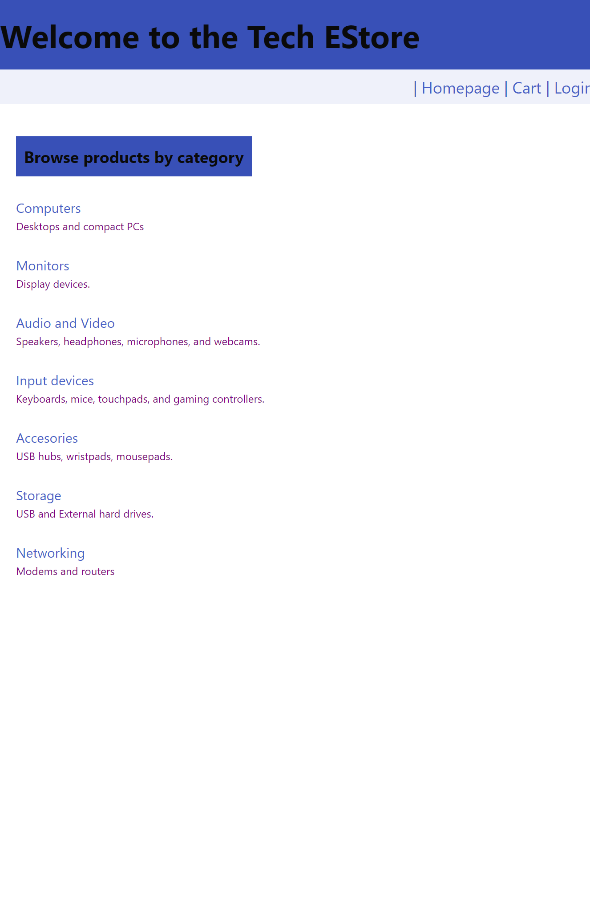
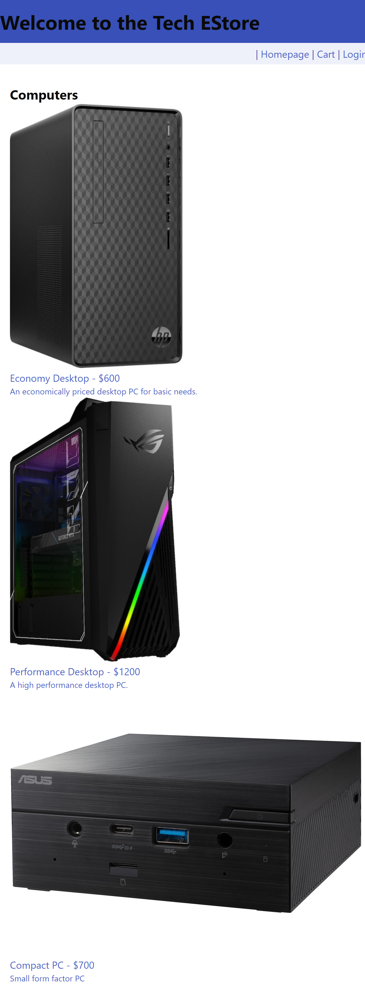
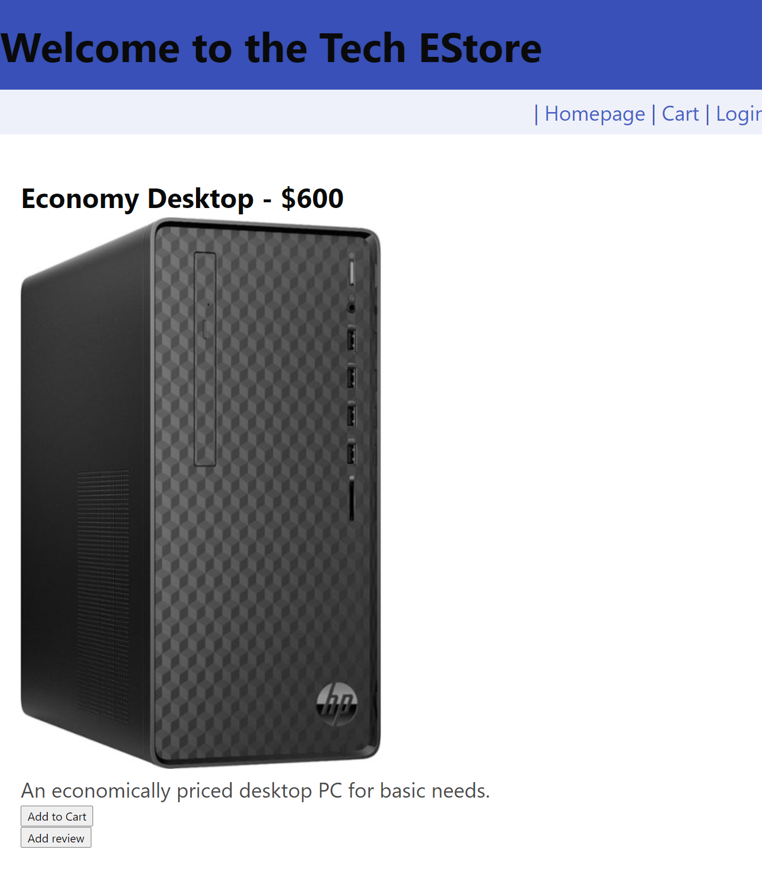

# Tech E-commerce site.
## A web site to shop for electronic products.

## Description:
This page allows you to view a selection of electronic products sorted by categories. You can read and write reviews, add items to your cart, and checkout. 

## Table of Contents:
[User Story](#User-Story) 
[Installation](#Installation) 
[Usage](#Usage) 
[Tests](#Tests) 
[Contributions](#Contributions) 
[Contact](#Contact) 
[License](#License) 

## User Story:
- AS A consumer
- I WANT visit one web site
- SO THAT I can purchase all electronic products I need

## Acceptance Criteria
Acceptance Criteria

Given a E-commerce website to shop Electronic Devices
When I visit the site for the first time
Then I am presented with the homepage with all the categories of Electronic Devices available and an option to login.
When I login, then I can select a category and look at all the products available for the category
When I select a product, I can see the reviews and option to add it to cart.
When I go to the cart, I can add or remove Products and place the order.

## Installation:
If you want to use or develop this application locally, clone the repository and install dependencies by running `npm i` in your terminal in the root folder. 
The MySQL connection uses a `.env` to hold the user, password, and database name. Create a `.env` file or replace credentials in `config/connection.js` with a hardcoded user, password, and database. 
Run `npm run seed` to seed the database, and `npm start` to start the application.

## Usage:

Image: 
 
Image: 
 
Image: 
 

## Tests:
No tests are currently included.

## Contributions:
Technologies used include JavaScript, Node.js, MySQL2, Express, Express-Session, Bcrypt, Handlebars, Sequelize, Dotenv, and Bulma.

## Contact:
- [James Hacklander's Github](https://github.com/MonsAltus). 
- Email: <hacklander.dev@gmail.com>  

- [Poly Singh's Github](https://github.com/poly-singh). 
- Email: <poly.singh11@gmail.com>  

- [Aldwin Lubrica's Github](https://github.com/aldwinlub). 
- Email: <aldwin.lub@gmail.com>  

## License:
Covered under the [MIT License](https://github.com/MonsAltus/Tech-EStore/blob/main/LICENSE).
